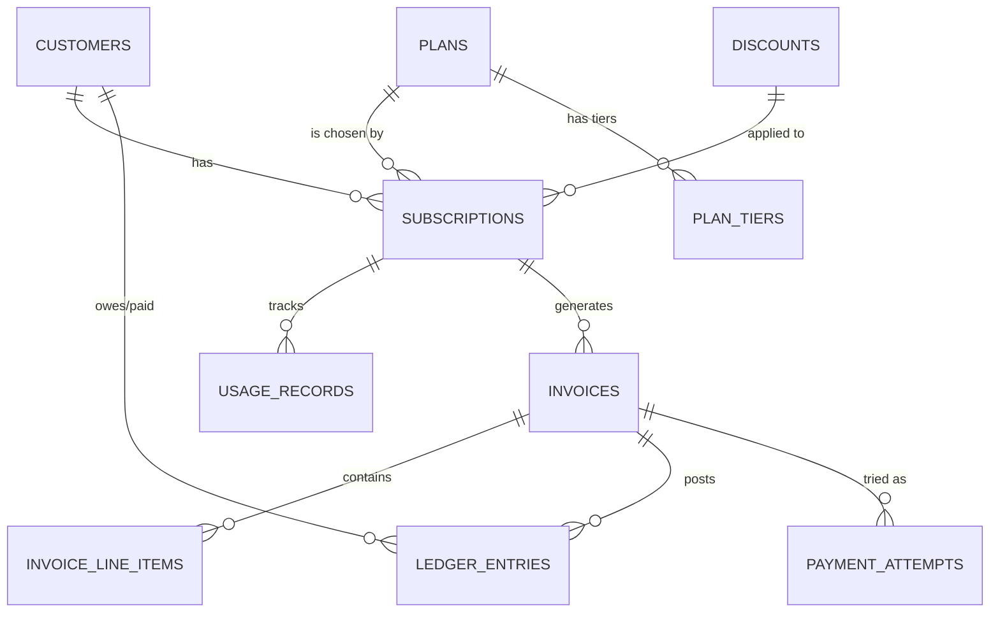
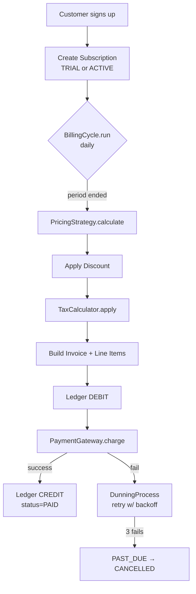

[](https://classroom.github.com/a/aMTfmtFR)
# Subscription Billing Engine — Starter Skeleton

Welcome! This is the **starter skeleton** for the Subscription Billing Engine capstone project. This is an **individual** project — you own the whole thing. Over the next 4 days you will fill in the `TODO` blocks and make every failing test pass.

> **Do NOT redesign the architecture.** The folder structure, class boundaries, and method signatures have been chosen deliberately to teach you good design. Your job is to supply the *behavior*, not redesign the *shape*.

---

## How this project works

You won't be writing tests — **the tests are already written for you**. Your job is to make them pass.

This is the [Test-Driven Development](https://en.wikipedia.org/wiki/Test-driven_development) workflow:
1. Run `pytest` → see lots of failing tests with clear messages.
2. Open the file the test is checking.
3. Implement the `TODO` until the test goes green.
4. Repeat until everything is green.

The tests ARE the specification. Read them carefully — they tell you exactly what each method should do.

---

## What's already done for you

| Module | Status | Why |
|---|---|---|
| `billing_engine/money.py` | ✅ **Done** — read it, understand it | Building block, not a learning goal |
| `billing_engine/models/*` | ✅ **Done** — dataclasses defined | Saves you tedious typing |
| `billing_engine/db/schema.sql` | ✅ **Done** — 10 tables with FKs | Schema design is a separate course |
| `billing_engine/db/database.py` | ✅ **Done** — connection helper | Boilerplate |
| All ABCs (`base.py` files) | ✅ **Done** — abstract method signatures | They define the contract |
| **All test files** | ✅ **Done** — every test fully written | Tests are your spec |

## What YOU implement

Every file with a `TODO` comment. Run `grep -rn "TODO" billing_engine_starter/billing_engine/` from the repository root, or `cd billing_engine_starter` first and run `grep -rn "TODO" billing_engine/`.

Your work, day by day:
- **[billing_engine_starter/DAY1_TASKS.md](billing_engine_starter/DAY1_TASKS.md)** — pricing strategies + discounts + taxes (pure Python, no DB)
- **[billing_engine_starter/DAY2_TASKS.md](billing_engine_starter/DAY2_TASKS.md)** — SQLite repositories + invoicing pipeline
- **[billing_engine_starter/DAY3_TASKS.md](billing_engine_starter/DAY3_TASKS.md)** — `BillingCycle.run` + billing-cycle integration + payment groundwork
- **[billing_engine_starter/DAY4_TASKS.md](billing_engine_starter/DAY4_TASKS.md)** — dunning + proration + CLI demo

Read [billing_engine_starter/CONVENTIONS.md](billing_engine_starter/CONVENTIONS.md) **before writing any code**. The rules in there are not optional.

---

## PDF generation is OPTIONAL

In the original product, invoices are PDFs. For this 4-day project, invoices are **plain text** (printed by `billing invoice show`). The PDF renderer scaffolding exists in `billing_engine_starter/billing_engine/pdf/` as a **bonus** — implement it only if you finish everything else and want extra credit. See the "Bonus" section in [billing_engine_starter/DAY4_TASKS.md](billing_engine_starter/DAY4_TASKS.md).

---

## Setup (5 minutes)

```bash
# 1. Create a virtualenv from the repository root
python3 -m venv .venv
source .venv/bin/activate

# 2. Install dependencies from the repository root
pip install -e ".[dev]"

# 3. Switch into the starter workspace
cd billing_engine_starter

# 4. Run the tests — most should fail. That's expected.
pytest -v

# 5. Find every TODO you need to implement
grep -rn "TODO" billing_engine/
```

When all tests pass and `python -m billing_engine.cli demo` runs end-to-end, you are done.

---

## ER Diagram



## End-to-End Flow



---

## Folder Structure

```
python-engineering-capstone/
├── README.md                  ← (you are here)
├── pyproject.toml             ← packaging + editable install metadata
└── billing_engine_starter/
    ├── CONVENTIONS.md         ← READ FIRST
    ├── DAY1_TASKS.md          ← Day 1 work
    ├── DAY2_TASKS.md          ← Day 2 work
    ├── DAY3_TASKS.md          ← Day 3 work
    ├── DAY4_TASKS.md          ← Day 4 work
    ├── INSTRUCTOR_GUIDE.md
    ├── pytest.ini
    ├── billing_engine/
    │   ├── money.py           ✅ DONE
    │   ├── pricing/           ⚠️ Implement subclasses (Day 1)
    │   ├── discounts/         ⚠️ Implement subclasses (Day 1)
    │   ├── taxes/             ⚠️ Implement subclasses (Day 1)
    │   ├── models/            ✅ DONE
    │   ├── db/
    │   │   ├── schema.sql     ✅ DONE
    │   │   ├── database.py    ✅ DONE
    │   │   └── repository.py  ⚠️ Implement methods (Day 2-4)
    │   ├── billing/           ⚠️ Implement workflows (Day 2-4)
    │   ├── payments/          ⚠️ Implement gateway (Day 3)
    │   ├── pdf/               🎁 BONUS only
    │   └── cli.py             ⚠️ Wire it up (Day 4)
    └── tests/                 ✅ ALL TESTS WRITTEN
```

---

## Ground rules (also in CONVENTIONS.md)

1. **No `float` for money.** Ever. Use `Money` / `Decimal`.
2. **No `isinstance` on strategies / discounts / taxes.** Use polymorphism.
3. **No SQL outside `db/repository.py`.** Domain code calls repo methods.
4. **Never `UPDATE` or `DELETE` from `ledger_entries`.** Corrections are new entries.
5. **Commit often. Push daily.** End-of-day work lives on the remote.

Good luck. Build something correct.
